# [📈 Live Status](https://abteilung.github.io/upptime): <!--live status--> **🟧 Partial outage**

This repository contains the open-source uptime monitor and status page for [Abteilung für Gestaltung GmbH](http://www.abteilung.ch), powered by [Upptime](https://github.com/upptime/upptime).

With [Upptime](https://upptime.js.org), you can get your own unlimited and free uptime monitor and status page, powered entirely by a GitHub repository. We use [Issues](https://github.com/abteilung/upptime/issues) as incident reports, [Actions](https://github.com/abteilung/upptime/actions) as uptime monitors, and [Pages](https://abteilung.github.io/upptime) for the status page.

<!--start: status pages-->
<!-- This summary is generated by Upptime (https://github.com/upptime/upptime) -->
<!-- Do not edit this manually, your changes will be overwritten -->
<!-- prettier-ignore -->
| URL | Status | History | Response Time | Uptime |
| --- | ------ | ------- | ------------- | ------ |
|  [Abteilung.ch](https://abteilung.ch) | 🟥 Down | [abteilung-ch.yml](https://github.com/abteilung/upptime/commits/HEAD/history/abteilung-ch.yml) | 

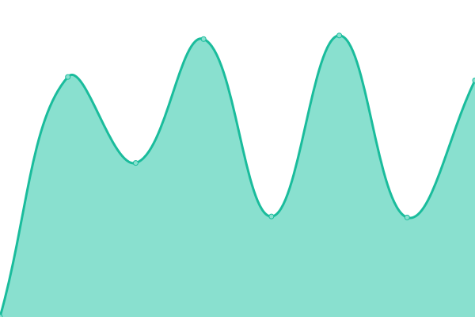 1086ms
     
 | 

<a href="https://abteilung.github.io/upptime/history/abteilung-ch">99.97%</a>
    

|  [Aarvia AG](https://aarvia.ch) | 🟩 Up | [aarvia-ag.yml](https://github.com/abteilung/upptime/commits/HEAD/history/aarvia-ag.yml) | 

 1023ms
     
 | 

<a href="https://abteilung.github.io/upptime/history/aarvia-ag">100.00%</a>
    

|  [Ades.ch](https://ades.ch) | 🟩 Up | [ades-ch.yml](https://github.com/abteilung/upptime/commits/HEAD/history/ades-ch.yml) | 

 1120ms
     
 | 

<a href="https://abteilung.github.io/upptime/history/ades-ch">100.00%</a>
    

|  [All in One VT](https://allinone-vt.ch) | 🟥 Down | [all-in-one-vt.yml](https://github.com/abteilung/upptime/commits/HEAD/history/all-in-one-vt.yml) | 

 0ms
     
 | 

<a href="https://abteilung.github.io/upptime/history/all-in-one-vt">99.98%</a>
    

|  [Auf Sicher CH](https://auf-sicher.ch) | 🟩 Up | [auf-sicher-ch.yml](https://github.com/abteilung/upptime/commits/HEAD/history/auf-sicher-ch.yml) | 

 2308ms
     
 | 

<a href="https://abteilung.github.io/upptime/history/auf-sicher-ch">100.00%</a>
    

|  [Ally.Vision](https://ally.vision) | 🟩 Up | [ally-vision.yml](https://github.com/abteilung/upptime/commits/HEAD/history/ally-vision.yml) | 

 1384ms
     
 | 

<a href="https://abteilung.github.io/upptime/history/ally-vision">100.00%</a>
    

|  [My.Ally.Vision](https://my.ally.vision) | 🟩 Up | [my-ally-vision.yml](https://github.com/abteilung/upptime/commits/HEAD/history/my-ally-vision.yml) | 

 3005ms
     
 | 

<a href="https://abteilung.github.io/upptime/history/my-ally-vision">100.00%</a>
    

|  [Auf Sicher Swiss](https://auf-sicher.swiss) | 🟥 Down | [auf-sicher-swiss.yml](https://github.com/abteilung/upptime/commits/HEAD/history/auf-sicher-swiss.yml) | 

 0ms
     
 | 

<a href="https://abteilung.github.io/upptime/history/auf-sicher-swiss">100.00%</a>
    

|  [Baerlocher Legate](https://baerlocher-legate.ch) | 🟩 Up | [baerlocher-legate.yml](https://github.com/abteilung/upptime/commits/HEAD/history/baerlocher-legate.yml) | 

 1408ms
     
 | 

<a href="https://abteilung.github.io/upptime/history/baerlocher-legate">100.00%</a>
    

|  [Barcli Hotels](https://barclihotels.com) | 🟩 Up | [barcli-hotels.yml](https://github.com/abteilung/upptime/commits/HEAD/history/barcli-hotels.yml) | 

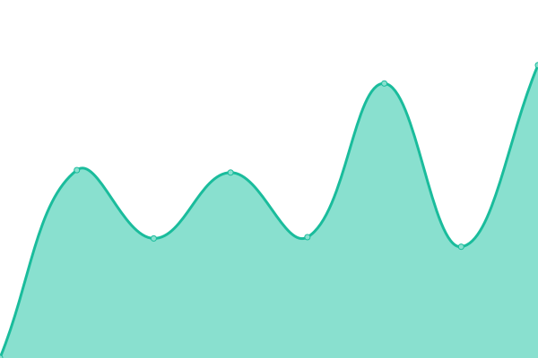 1210ms
     
 | 

<a href="https://abteilung.github.io/upptime/history/barcli-hotels">100.00%</a>
    

|  [Barcli Hospitality](https://barclihospitality.com) | 🟥 Down | [barcli-hospitality.yml](https://github.com/abteilung/upptime/commits/HEAD/history/barcli-hospitality.yml) | 

 0ms
     
 | 

<a href="https://abteilung.github.io/upptime/history/barcli-hospitality">100.00%</a>
    

|  [BETM](https://betm.ch) | 🟩 Up | [betm.yml](https://github.com/abteilung/upptime/commits/HEAD/history/betm.yml) | 

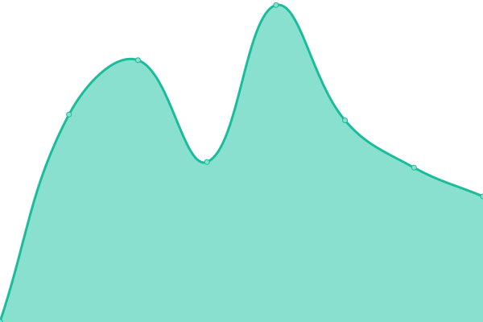 805ms
     
 | 

<a href="https://abteilung.github.io/upptime/history/betm">100.00%</a>
    

|  [Bonnie & Clyde](https://bonnie-and-clyde.com) | 🟥 Down | [bonnie-and-clyde.yml](https://github.com/abteilung/upptime/commits/HEAD/history/bonnie-and-clyde.yml) | 

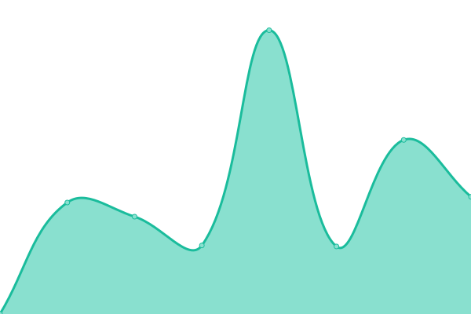 1871ms
     
 | 

<a href="https://abteilung.github.io/upptime/history/bonnie-and-clyde">0.00%</a>
    

|  [BVI AG (Domain bviag.ch)](https://bviag.ch) | 🟩 Up | [bvi-ag-domain-bviag-ch.yml](https://github.com/abteilung/upptime/commits/HEAD/history/bvi-ag-domain-bviag-ch.yml) | 

 548ms
     
 | 

<a href="https://abteilung.github.io/upptime/history/bvi-ag-domain-bviag-ch">100.00%</a>
    

|  [Communtia](https://communtia.ch) | 🟥 Down | [communtia.yml](https://github.com/abteilung/upptime/commits/HEAD/history/communtia.yml) | 

 0ms
     
 | 

<a href="https://abteilung.github.io/upptime/history/communtia">0.00%</a>
    

|  [Daniela Schlegel](https://danielaschlegel.ch) | 🟩 Up | [daniela-schlegel.yml](https://github.com/abteilung/upptime/commits/HEAD/history/daniela-schlegel.yml) | 

 1737ms
     
 | 

<a href="https://abteilung.github.io/upptime/history/daniela-schlegel">100.00%</a>
    

|  [Daniel Brüngger](https://danielbruengger.ch) | 🟩 Up | [daniel-bruengger.yml](https://github.com/abteilung/upptime/commits/HEAD/history/daniel-bruengger.yml) | 

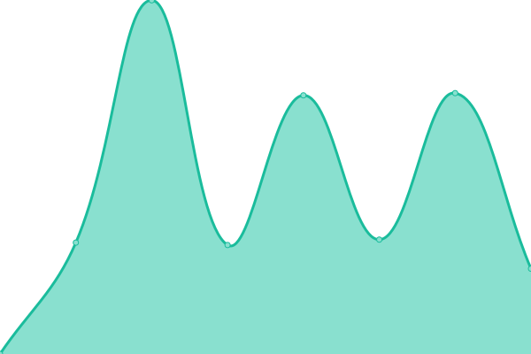 1730ms
     
 | 

<a href="https://abteilung.github.io/upptime/history/daniel-bruengger">100.00%</a>
    

|  [Der Baumpfleger](https://derbaumpfleger.ch) | 🟩 Up | [der-baumpfleger.yml](https://github.com/abteilung/upptime/commits/HEAD/history/der-baumpfleger.yml) | 

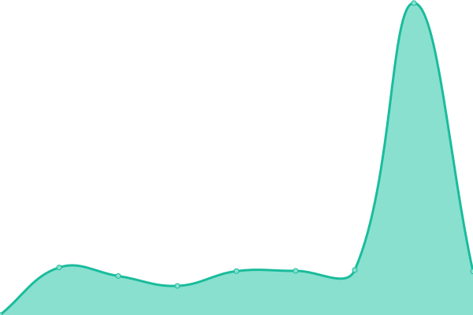 1181ms
     
 | 

<a href="https://abteilung.github.io/upptime/history/der-baumpfleger">100.00%</a>
    

|  [Die Coacherei](https://die-coacherei.ch) | 🟩 Up | [die-coacherei.yml](https://github.com/abteilung/upptime/commits/HEAD/history/die-coacherei.yml) | 

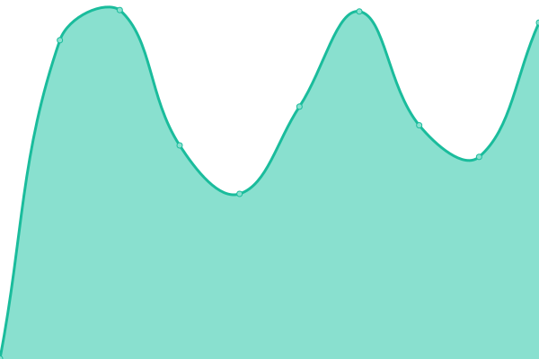 786ms
     
 | 

<a href="https://abteilung.github.io/upptime/history/die-coacherei">100.00%</a>
    

|  [Dike Verlag](https://dike.ch) | 🟩 Up | [dike-verlag.yml](https://github.com/abteilung/upptime/commits/HEAD/history/dike-verlag.yml) | 

 3037ms
     
 | 

<a href="https://abteilung.github.io/upptime/history/dike-verlag">100.00%</a>
    

|  [DSIM](https://dsim.ch) | 🟩 Up | [dsim.yml](https://github.com/abteilung/upptime/commits/HEAD/history/dsim.yml) | 

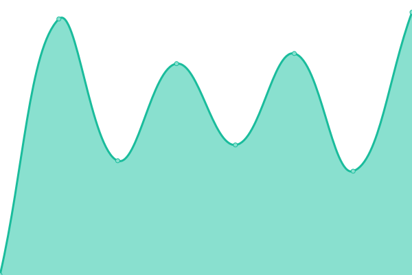 743ms
     
 | 

<a href="https://abteilung.github.io/upptime/history/dsim">100.00%</a>
    

|  [Dunedin Arts](https://dunedin-arts.ch) | 🟩 Up | [dunedin-arts.yml](https://github.com/abteilung/upptime/commits/HEAD/history/dunedin-arts.yml) | 

 1913ms
     
 | 

<a href="https://abteilung.github.io/upptime/history/dunedin-arts">100.00%</a>
    

|  [ELK](http://elk.ie) | 🟩 Up | [elk.yml](https://github.com/abteilung/upptime/commits/HEAD/history/elk.yml) | 

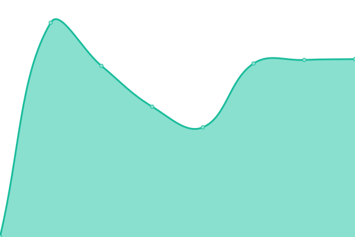 849ms
     
 | 

<a href="https://abteilung.github.io/upptime/history/elk">0.00%</a>
    

|  [EAO](https://eao.com) | 🟩 Up | [eao.yml](https://github.com/abteilung/upptime/commits/HEAD/history/eao.yml) | 

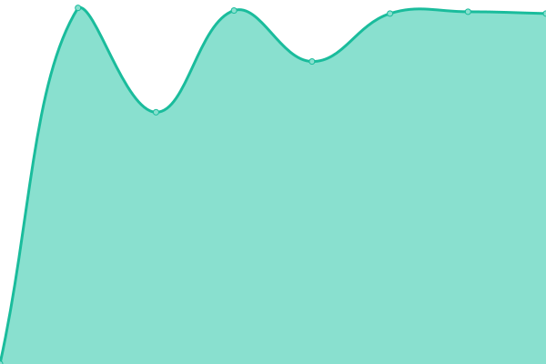 1594ms
     
 | 

<a href="https://abteilung.github.io/upptime/history/eao">100.00%</a>
    

|  [EBC Brugg](https://ebc-brugg.ch) | 🟩 Up | [ebc-brugg.yml](https://github.com/abteilung/upptime/commits/HEAD/history/ebc-brugg.yml) | 

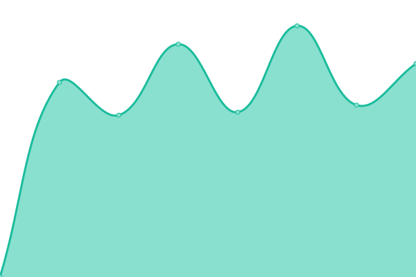 811ms
     
 | 

<a href="https://abteilung.github.io/upptime/history/ebc-brugg">100.00%</a>
    

|  [Elternverein Meilen](https://elternvereinmeilen.ch) | 🟩 Up | [elternverein-meilen.yml](https://github.com/abteilung/upptime/commits/HEAD/history/elternverein-meilen.yml) | 

 956ms
     
 | 

<a href="https://abteilung.github.io/upptime/history/elternverein-meilen">100.00%</a>
    

|  [Elternverein Rüschlikon](https://elternverein-rueschlikon.ch) | 🟩 Up | [elternverein-rueschlikon.yml](https://github.com/abteilung/upptime/commits/HEAD/history/elternverein-rueschlikon.yml) | 

 2657ms
     
 | 

<a href="https://abteilung.github.io/upptime/history/elternverein-rueschlikon">100.00%</a>
    

|  [Eweco](https://eweco.ch) | 🟩 Up | [eweco.yml](https://github.com/abteilung/upptime/commits/HEAD/history/eweco.yml) | 

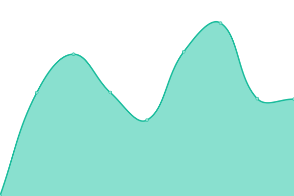 859ms
     
 | 

<a href="https://abteilung.github.io/upptime/history/eweco">100.00%</a>
    

|  [Ferienwohnugn Vazerol](https://ferienwohnungvazerol.com) | 🟩 Up | [ferienwohnugn-vazerol.yml](https://github.com/abteilung/upptime/commits/HEAD/history/ferienwohnugn-vazerol.yml) | 

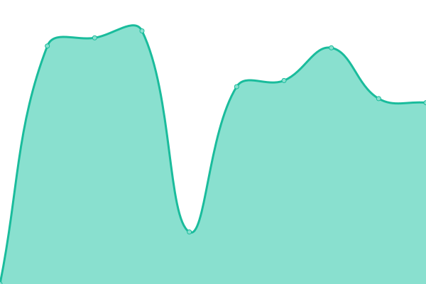 1916ms
     
 | 

<a href="https://abteilung.github.io/upptime/history/ferienwohnugn-vazerol">100.00%</a>
    

|  [Folienmaster](https://folienmaster.ch) | 🟩 Up | [folienmaster.yml](https://github.com/abteilung/upptime/commits/HEAD/history/folienmaster.yml) | 

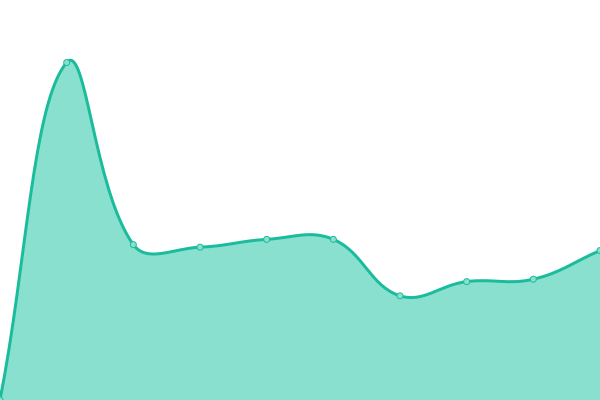 814ms
     
 | 

<a href="https://abteilung.github.io/upptime/history/folienmaster">100.00%</a>
    

|  [Furore Kanalservice](https://furore.gmbh) | 🟩 Up | [furore-kanalservice.yml](https://github.com/abteilung/upptime/commits/HEAD/history/furore-kanalservice.yml) | 

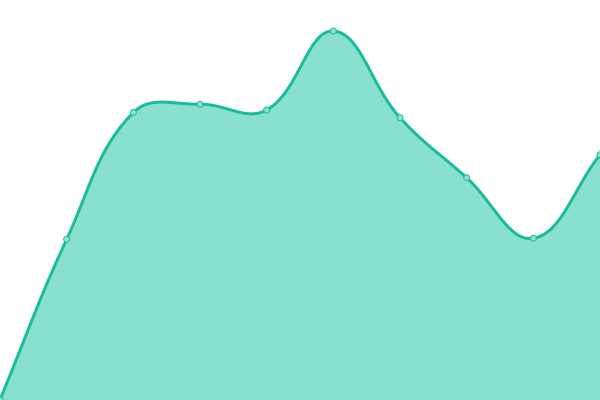 994ms
     
 | 

<a href="https://abteilung.github.io/upptime/history/furore-kanalservice">100.00%</a>
    

|  [Forum Pfarrblatt](https://forum-pfarrblatt.ch) | 🟩 Up | [forum-pfarrblatt.yml](https://github.com/abteilung/upptime/commits/HEAD/history/forum-pfarrblatt.yml) | 

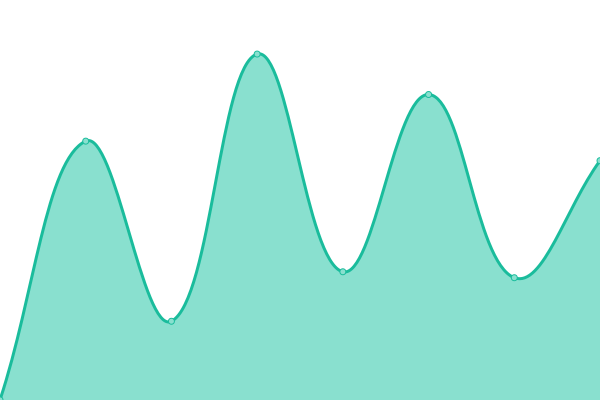 959ms
     
 | 

<a href="https://abteilung.github.io/upptime/history/forum-pfarrblatt">100.00%</a>
    

|  [Gees Metall](https://geesmetall.ch) | 🟩 Up | [gees-metall.yml](https://github.com/abteilung/upptime/commits/HEAD/history/gees-metall.yml) | 

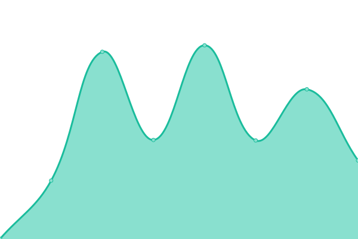 894ms
     
 | 

<a href="https://abteilung.github.io/upptime/history/gees-metall">100.00%</a>
    

|  [Green Drains](https://green-drains.ch) | 🟩 Up | [green-drains.yml](https://github.com/abteilung/upptime/commits/HEAD/history/green-drains.yml) | 

 1242ms
     
 | 

<a href="https://abteilung.github.io/upptime/history/green-drains">100.00%</a>
    

|  [Hand Dryer](https://handdryer.com) | 🟩 Up | [hand-dryer.yml](https://github.com/abteilung/upptime/commits/HEAD/history/hand-dryer.yml) | 

 443ms
     
 | 

<a href="https://abteilung.github.io/upptime/history/hand-dryer">100.00%</a>
    

|  [Heryanora](https://heryanora.com) | 🟩 Up | [heryanora.yml](https://github.com/abteilung/upptime/commits/HEAD/history/heryanora.yml) | 

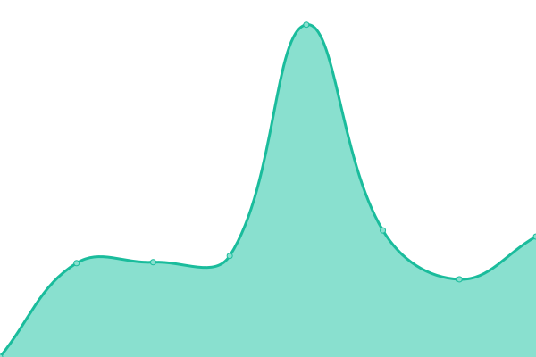 835ms
     
 | 

<a href="https://abteilung.github.io/upptime/history/heryanora">100.00%</a>
    

|  [Hoffmann Coaching](https://hoffmanncoaching.ch) | 🟩 Up | [hoffmann-coaching.yml](https://github.com/abteilung/upptime/commits/HEAD/history/hoffmann-coaching.yml) | 

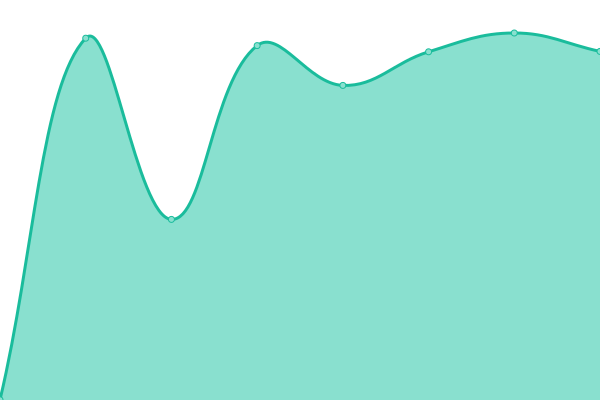 1358ms
     
 | 

<a href="https://abteilung.github.io/upptime/history/hoffmann-coaching">100.00%</a>
    

|  [Humid-or](https://humid-or.ch) | 🟩 Up | [humid-or.yml](https://github.com/abteilung/upptime/commits/HEAD/history/humid-or.yml) | 

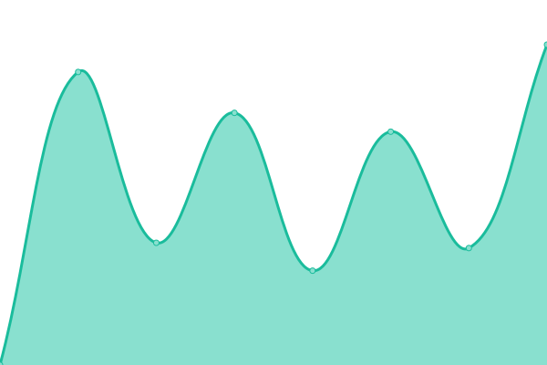 1690ms
     
 | 

<a href="https://abteilung.github.io/upptime/history/humid-or">100.00%</a>
    

|  [Immobilien 4 you](https://immobilien4you.ch) | 🟩 Up | [immobilien-4-you.yml](https://github.com/abteilung/upptime/commits/HEAD/history/immobilien-4-you.yml) | 

 920ms
     
 | 

<a href="https://abteilung.github.io/upptime/history/immobilien-4-you">100.00%</a>
    

|  [Immobilienwelten](https://immobilienwelten.ch) | 🟩 Up | [immobilienwelten.yml](https://github.com/abteilung/upptime/commits/HEAD/history/immobilienwelten.yml) | 

 804ms
     
 | 

<a href="https://abteilung.github.io/upptime/history/immobilienwelten">100.00%</a>
    

|  [Isenbügel](https://isenbuegel.ch) | 🟩 Up | [isenbuegel.yml](https://github.com/abteilung/upptime/commits/HEAD/history/isenbuegel.yml) | 

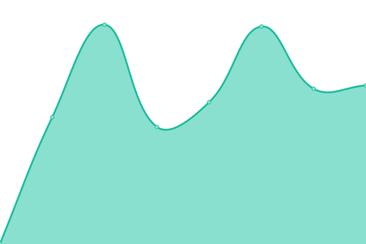 593ms
     
 | 

<a href="https://abteilung.github.io/upptime/history/isenbuegel">0.00%</a>
    

|  [Kiwanis Höngg](https://kiwanis-hoengg.ch) | 🟩 Up | [kiwanis-hoengg.yml](https://github.com/abteilung/upptime/commits/HEAD/history/kiwanis-hoengg.yml) | 

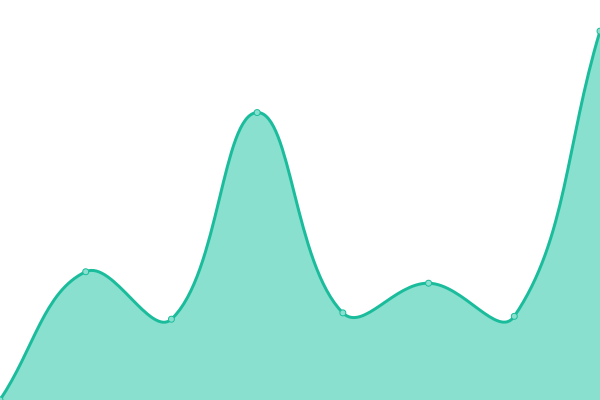 1005ms
     
 | 

<a href="https://abteilung.github.io/upptime/history/kiwanis-hoengg">100.00%</a>
    

|  [Landolf & Huber Juweliere](https://landolfhuber.ch) | 🟩 Up | [landolf-and-huber-juweliere.yml](https://github.com/abteilung/upptime/commits/HEAD/history/landolf-and-huber-juweliere.yml) | 

 1241ms
     
 | 

<a href="https://abteilung.github.io/upptime/history/landolf-and-huber-juweliere">100.00%</a>
    

|  [Lesen & Schreiben Bern](https://lesenschreiben-bern.ch/) | 🟩 Up | [lesen-and-schreiben-bern.yml](https://github.com/abteilung/upptime/commits/HEAD/history/lesen-and-schreiben-bern.yml) | 

 1893ms
     
 | 

<a href="https://abteilung.github.io/upptime/history/lesen-and-schreiben-bern">100.00%</a>
    

|  [Licht-Raum](https://licht-raum.ch/) | 🟩 Up | [licht-raum.yml](https://github.com/abteilung/upptime/commits/HEAD/history/licht-raum.yml) | 

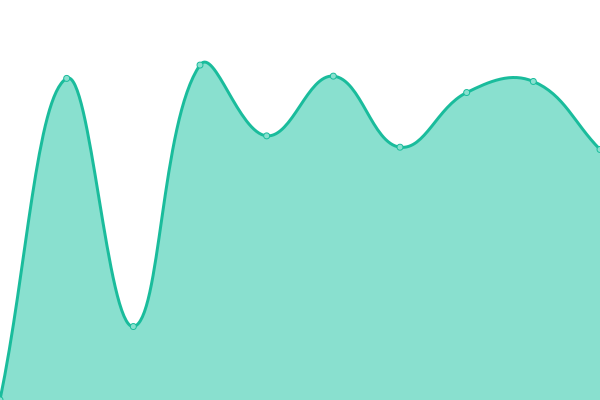 2180ms
     
 | 

<a href="https://abteilung.github.io/upptime/history/licht-raum">100.00%</a>
    

|  [Linguaprima](https://linguaprima.ch) | 🟥 Down | [linguaprima.yml](https://github.com/abteilung/upptime/commits/HEAD/history/linguaprima.yml) | 

 591ms
     
 | 

<a href="https://abteilung.github.io/upptime/history/linguaprima">0.00%</a>
    

|  [Lyner Haustechnik AG](https://lyner-haustechnik.ch/) | 🟩 Up | [lyner-haustechnik-ag.yml](https://github.com/abteilung/upptime/commits/HEAD/history/lyner-haustechnik-ag.yml) | 

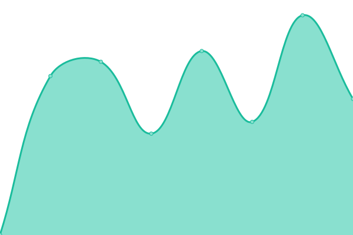 920ms
     
 | 

<a href="https://abteilung.github.io/upptime/history/lyner-haustechnik-ag">100.00%</a>
    

|  [Macun CP](https://macuncp.ch) | 🟩 Up | [macun-cp.yml](https://github.com/abteilung/upptime/commits/HEAD/history/macun-cp.yml) | 

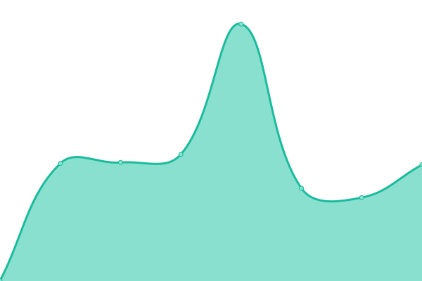 942ms
     
 | 

<a href="https://abteilung.github.io/upptime/history/macun-cp">100.00%</a>
    

|  [Matthias Lebo](https://matthiaslebo.com) | 🟩 Up | [matthias-lebo.yml](https://github.com/abteilung/upptime/commits/HEAD/history/matthias-lebo.yml) | 

 1693ms
     
 | 

<a href="https://abteilung.github.io/upptime/history/matthias-lebo">100.00%</a>
    

|  [Mikro Repro](https://mikrorepro.ch) | 🟩 Up | [mikro-repro.yml](https://github.com/abteilung/upptime/commits/HEAD/history/mikro-repro.yml) | 

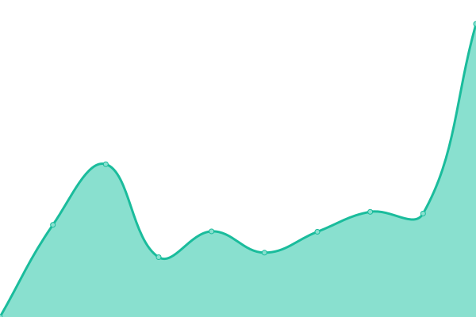 1538ms
     
 | 

<a href="https://abteilung.github.io/upptime/history/mikro-repro">100.00%</a>
    

|  [Neuezeit Akademie](https://neuezeit-akademie.swiss) | 🟩 Up | [neuezeit-akademie.yml](https://github.com/abteilung/upptime/commits/HEAD/history/neuezeit-akademie.yml) | 

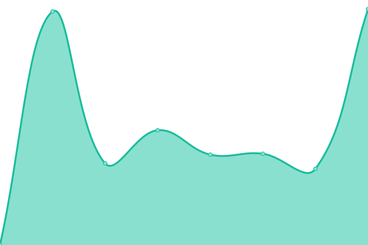 1053ms
     
 | 

<a href="https://abteilung.github.io/upptime/history/neuezeit-akademie">100.00%</a>
    

|  [Pfaller AG](https://pfaller.ch) | 🟩 Up | [pfaller-ag.yml](https://github.com/abteilung/upptime/commits/HEAD/history/pfaller-ag.yml) | 

 1560ms
     
 | 

<a href="https://abteilung.github.io/upptime/history/pfaller-ag">100.00%</a>
    

|  [Physio-Burgernziel](https://physio-burgernziel.ch) | 🟥 Down | [physio-burgernziel.yml](https://github.com/abteilung/upptime/commits/HEAD/history/physio-burgernziel.yml) | 

 0ms
     
 | 

<a href="https://abteilung.github.io/upptime/history/physio-burgernziel">100.00%</a>
    

|  [Polydesign 3D](https://p3d.ch) | 🟩 Up | [polydesign-3-d.yml](https://github.com/abteilung/upptime/commits/HEAD/history/polydesign-3-d.yml) | 

 1044ms
     
 | 

<a href="https://abteilung.github.io/upptime/history/polydesign-3-d">100.00%</a>
    

|  [Ramseier Assoc](https://ramseier-assoc.com) | 🟩 Up | [ramseier-assoc.yml](https://github.com/abteilung/upptime/commits/HEAD/history/ramseier-assoc.yml) | 

 1659ms
     
 | 

<a href="https://abteilung.github.io/upptime/history/ramseier-assoc">100.00%</a>
    

|  [Re-Medium](https://re-medium.ch) | 🟩 Up | [re-medium.yml](https://github.com/abteilung/upptime/commits/HEAD/history/re-medium.yml) | 

 952ms
     
 | 

<a href="https://abteilung.github.io/upptime/history/re-medium">100.00%</a>
    

|  [Regimo](https://regimo.ch) | 🟩 Up | [regimo.yml](https://github.com/abteilung/upptime/commits/HEAD/history/regimo.yml) | 

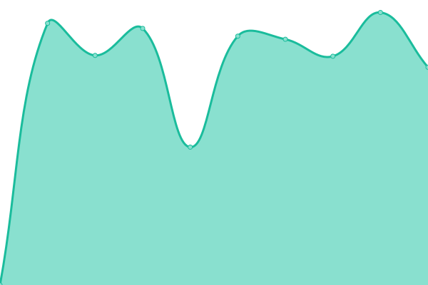 4033ms
     
 | 

<a href="https://abteilung.github.io/upptime/history/regimo">100.00%</a>
    

|  [Roger Hoch](https://rogerhoch-zahnarzt.ch) | 🟩 Up | [roger-hoch.yml](https://github.com/abteilung/upptime/commits/HEAD/history/roger-hoch.yml) | 

 782ms
     
 | 

<a href="https://abteilung.github.io/upptime/history/roger-hoch">100.00%</a>
    

|  [Ruggli Partner](https://rugglipartner.ch) | 🟩 Up | [ruggli-partner.yml](https://github.com/abteilung/upptime/commits/HEAD/history/ruggli-partner.yml) | 

 1002ms
     
 | 

<a href="https://abteilung.github.io/upptime/history/ruggli-partner">100.00%</a>
    

|  [Rychiger AG](https://rychiger.ch) | 🟩 Up | [rychiger-ag.yml](https://github.com/abteilung/upptime/commits/HEAD/history/rychiger-ag.yml) | 

 1128ms
     
 | 

<a href="https://abteilung.github.io/upptime/history/rychiger-ag">100.00%</a>
    

|  [Schweizer Röntgen](https://schweizer-roentgen.ch) | 🟩 Up | [schweizer-roentgen.yml](https://github.com/abteilung/upptime/commits/HEAD/history/schweizer-roentgen.yml) | 

 1347ms
     
 | 

<a href="https://abteilung.github.io/upptime/history/schweizer-roentgen">100.00%</a>
    

|  [Selfix AG](https://selfix.ch) | 🟩 Up | [selfix-ag.yml](https://github.com/abteilung/upptime/commits/HEAD/history/selfix-ag.yml) | 

 2698ms
     
 | 

<a href="https://abteilung.github.io/upptime/history/selfix-ag">100.00%</a>
    

|  [Sommeliers Choice](https://sommeliers-choice.ch) | 🟥 Down | [sommeliers-choice.yml](https://github.com/abteilung/upptime/commits/HEAD/history/sommeliers-choice.yml) | 

 1369ms
     
 | 

<a href="https://abteilung.github.io/upptime/history/sommeliers-choice">0.00%</a>
    

|  [Staub KG](https://staubkg.com) | 🟩 Up | [staub-kg.yml](https://github.com/abteilung/upptime/commits/HEAD/history/staub-kg.yml) | 

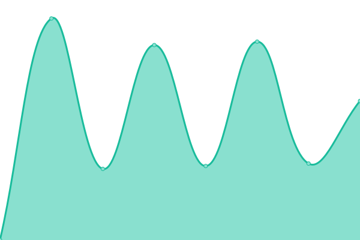 2734ms
     
 | 

<a href="https://abteilung.github.io/upptime/history/staub-kg">100.00%</a>
    

|  [Stefan Ackermann](https://stefanackermann.ch) | 🟩 Up | [stefan-ackermann.yml](https://github.com/abteilung/upptime/commits/HEAD/history/stefan-ackermann.yml) | 

 760ms
     
 | 

<a href="https://abteilung.github.io/upptime/history/stefan-ackermann">100.00%</a>
    

|  [Stephen Gould](https://stephengould.org) | 🟥 Down | [stephen-gould.yml](https://github.com/abteilung/upptime/commits/HEAD/history/stephen-gould.yml) | 

 606ms
     
 | 

<a href="https://abteilung.github.io/upptime/history/stephen-gould">0.00%</a>
    

|  [Stolkin](https://stolkin.ch) | 🟥 Down | [stolkin.yml](https://github.com/abteilung/upptime/commits/HEAD/history/stolkin.yml) | 

 577ms
     
 | 

<a href="https://abteilung.github.io/upptime/history/stolkin">100.00%</a>
    

|  [Swiss CCS](https://swissccs.com) | 🟩 Up | [swiss-ccs.yml](https://github.com/abteilung/upptime/commits/HEAD/history/swiss-ccs.yml) | 

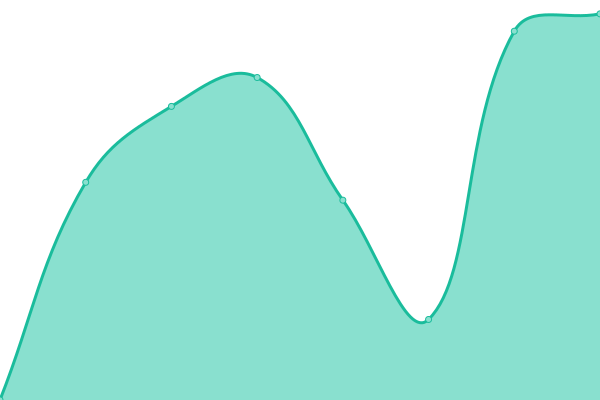 3372ms
     
 | 

<a href="https://abteilung.github.io/upptime/history/swiss-ccs">100.00%</a>
    

|  [SGUV](https://sguv.ch) | 🟩 Up | [sguv.yml](https://github.com/abteilung/upptime/commits/HEAD/history/sguv.yml) | 

 1713ms
     
 | 

<a href="https://abteilung.github.io/upptime/history/sguv">100.00%</a>
    

|  [TM Bachmann](https://tm-bachmann.ch) | 🟩 Up | [tm-bachmann.yml](https://github.com/abteilung/upptime/commits/HEAD/history/tm-bachmann.yml) | 

 586ms
     
 | 

<a href="https://abteilung.github.io/upptime/history/tm-bachmann">100.00%</a>
    

|  [Urimat](https://urimat.ch) | 🟩 Up | [urimat.yml](https://github.com/abteilung/upptime/commits/HEAD/history/urimat.yml) | 

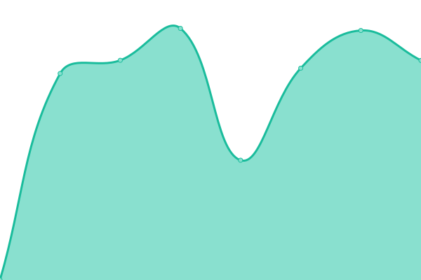 3076ms
     
 | 

<a href="https://abteilung.github.io/upptime/history/urimat">100.00%</a>
    

|  [Urimat COM](https://urimat.com) | 🟩 Up | [urimat-com.yml](https://github.com/abteilung/upptime/commits/HEAD/history/urimat-com.yml) | 

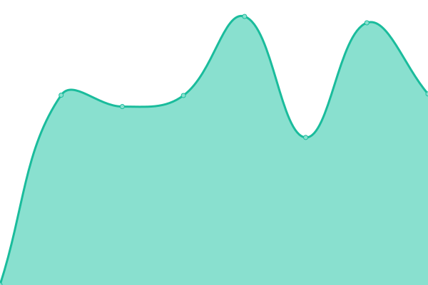 989ms
     
 | 

<a href="https://abteilung.github.io/upptime/history/urimat-com">100.00%</a>
    

|  [Urimat DE](https://urimat.de) | 🟩 Up | [urimat-de.yml](https://github.com/abteilung/upptime/commits/HEAD/history/urimat-de.yml) | 

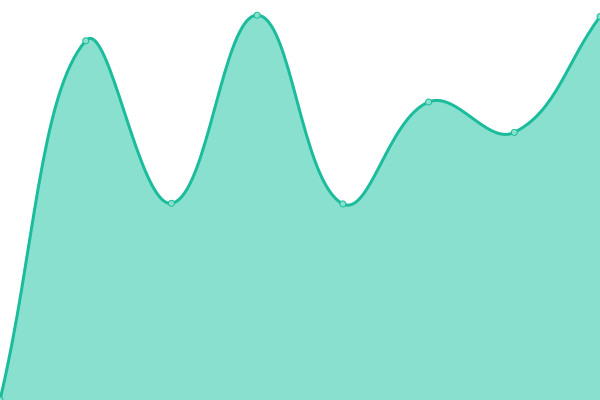 2287ms
     
 | 

<a href="https://abteilung.github.io/upptime/history/urimat-de">100.00%</a>
    

|  [Urimat ES](https://urimat.es) | 🟩 Up | [urimat-es.yml](https://github.com/abteilung/upptime/commits/HEAD/history/urimat-es.yml) | 

 1034ms
     
 | 

<a href="https://abteilung.github.io/upptime/history/urimat-es">100.00%</a>
    

|  [Urimat PT](https://urimat.pt) | 🟩 Up | [urimat-pt.yml](https://github.com/abteilung/upptime/commits/HEAD/history/urimat-pt.yml) | 

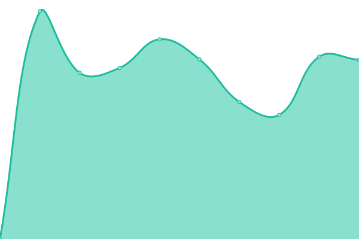 1294ms
     
 | 

<a href="https://abteilung.github.io/upptime/history/urimat-pt">100.00%</a>
    

|  [Valentin-Tools LI](https://valentin-tools.li) | 🟩 Up | [valentin-tools-li.yml](https://github.com/abteilung/upptime/commits/HEAD/history/valentin-tools-li.yml) | 

 609ms
     
 | 

<a href="https://abteilung.github.io/upptime/history/valentin-tools-li">100.00%</a>
    

|  [Wernis Team](https://wernisteam.ch) | 🟩 Up | [wernis-team.yml](https://github.com/abteilung/upptime/commits/HEAD/history/wernis-team.yml) | 

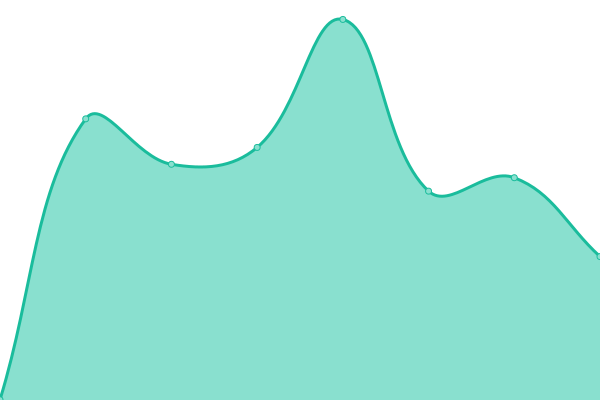 857ms
     
 | 

<a href="https://abteilung.github.io/upptime/history/wernis-team">100.00%</a>
    

|  [Wichser Partner](https://wichser-partner.ch) | 🟩 Up | [wichser-partner.yml](https://github.com/abteilung/upptime/commits/HEAD/history/wichser-partner.yml) | 

 789ms
     
 | 

<a href="https://abteilung.github.io/upptime/history/wichser-partner">100.00%</a>
    

|  [Wikipick](https://wikipick.ch) | 🟩 Up | [wikipick.yml](https://github.com/abteilung/upptime/commits/HEAD/history/wikipick.yml) | 

 2957ms
     
 | 

<a href="https://abteilung.github.io/upptime/history/wikipick">100.00%</a>
    

|  [Wini](https://wini.ch) | 🟩 Up | [wini.yml](https://github.com/abteilung/upptime/commits/HEAD/history/wini.yml) | 

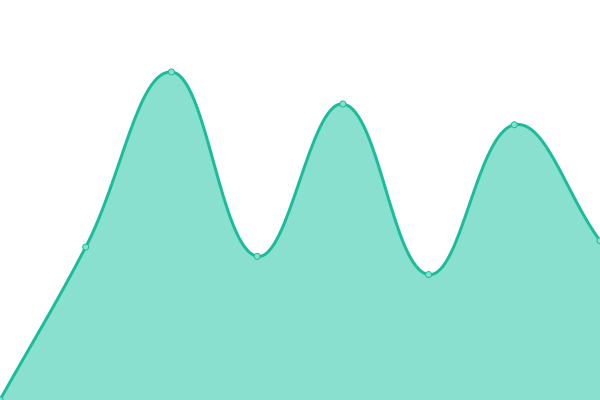 825ms
     
 | 

<a href="https://abteilung.github.io/upptime/history/wini">100.00%</a>
    

|  [Wipswiss](https://wipswiss.ch) | 🟩 Up | [wipswiss.yml](https://github.com/abteilung/upptime/commits/HEAD/history/wipswiss.yml) | 

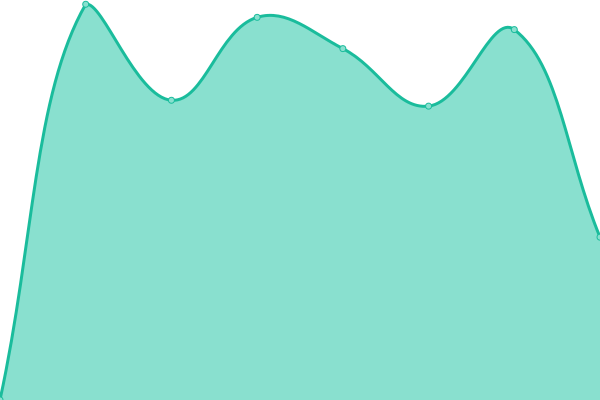 3486ms
     
 | 

<a href="https://abteilung.github.io/upptime/history/wipswiss">100.00%</a>
    

|  [Zweidler](https://2dler.ch) | 🟩 Up | [zweidler.yml](https://github.com/abteilung/upptime/commits/HEAD/history/zweidler.yml) | 

 940ms
     
 | 

<a href="https://abteilung.github.io/upptime/history/zweidler">100.00%</a>
    

<!--end: status pages-->

[**Visit our status website →**](https://abteilung.github.io/upptime)

## 📄 License

- Powered by: [Upptime](https://github.com/upptime/upptime)
- Code: [MIT](./LICENSE) © [Abteilung für Gestaltung GmbH](http://www.abteilung.ch)
- Data in the `./history` directory: [Open Database License](https://opendatacommons.org/licenses/odbl/1-0/)
