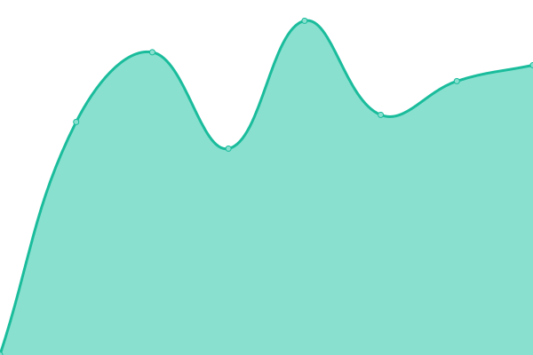
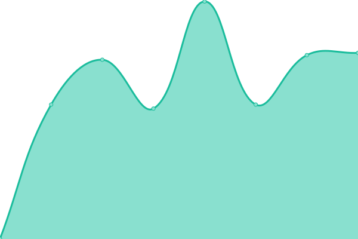
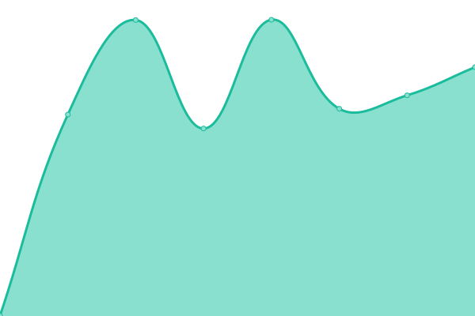
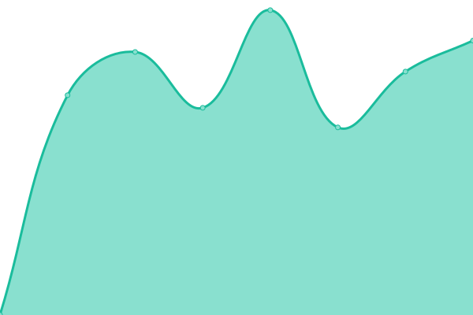

# [📈 Live Status](https://abteilung.github.io/upptime): <!--live status--> **🟧 Partial outage**

This repository contains the open-source uptime monitor and status page for [Abteilung für Gestaltung GmbH](http://www.abteilung.ch), powered by [Upptime](https://github.com/upptime/upptime).

With [Upptime](https://upptime.js.org), you can get your own unlimited and free uptime monitor and status page, powered entirely by a GitHub repository. We use [Issues](https://github.com/abteilung/upptime/issues) as incident reports, [Actions](https://github.com/abteilung/upptime/actions) as uptime monitors, and [Pages](https://abteilung.github.io/upptime) for the status page.

<!--start: status pages-->
<!-- This summary is generated by Upptime (https://github.com/upptime/upptime) -->
<!-- Do not edit this manually, your changes will be overwritten -->
<!-- prettier-ignore -->
| URL | Status | History | Response Time | Uptime |
| --- | ------ | ------- | ------------- | ------ |
|  [Abteilung.ch](https://abteilung.ch) | 🟩 Up | [abteilung-ch.yml](https://github.com/abteilung/upptime/commits/HEAD/history/abteilung-ch.yml) | 

 1012ms
     
 | 

<a href="https://abteilung.github.io/upptime/history/abteilung-ch">100.00%</a>
    

|  [Aarvia AG](https://aarvia.ch) | 🟩 Up | [aarvia-ag.yml](https://github.com/abteilung/upptime/commits/HEAD/history/aarvia-ag.yml) | 

 652ms
     
 | 

<a href="https://abteilung.github.io/upptime/history/aarvia-ag">100.00%</a>
    

|  [Ades.ch](https://ades.ch) | 🟩 Up | [ades-ch.yml](https://github.com/abteilung/upptime/commits/HEAD/history/ades-ch.yml) | 

 920ms
     
 | 

<a href="https://abteilung.github.io/upptime/history/ades-ch">100.00%</a>
    

|  [Ally.Vision](https://ally.vision) | 🟩 Up | [ally-vision.yml](https://github.com/abteilung/upptime/commits/HEAD/history/ally-vision.yml) | 

 1488ms
     
 | 

<a href="https://abteilung.github.io/upptime/history/ally-vision">100.00%</a>
    

|  [My.Ally.Vision](https://my.ally.vision) | 🟩 Up | [my-ally-vision.yml](https://github.com/abteilung/upptime/commits/HEAD/history/my-ally-vision.yml) | 

 3221ms
     
 | 

<a href="https://abteilung.github.io/upptime/history/my-ally-vision">100.00%</a>
    

|  [Asago AG](https://asago.ch) | 🟩 Up | [asago-ag.yml](https://github.com/abteilung/upptime/commits/HEAD/history/asago-ag.yml) | 

 2078ms
     
 | 

<a href="https://abteilung.github.io/upptime/history/asago-ag">100.00%</a>
    

|  [Barcli Hotels](https://barclihotels.com) | 🟩 Up | [barcli-hotels.yml](https://github.com/abteilung/upptime/commits/HEAD/history/barcli-hotels.yml) | 

 1410ms
     
 | 

<a href="https://abteilung.github.io/upptime/history/barcli-hotels">100.00%</a>
    

|  [Barcli Hospitality](https://barclihospitality.com) | 🟥 Down | [barcli-hospitality.yml](https://github.com/abteilung/upptime/commits/HEAD/history/barcli-hospitality.yml) | 

 0ms
     
 | 

<a href="https://abteilung.github.io/upptime/history/barcli-hospitality">1.54%</a>
    

|  [DSIM](https://dsim.ch) | 🟩 Up | [dsim.yml](https://github.com/abteilung/upptime/commits/HEAD/history/dsim.yml) | 

 863ms
     
 | 

<a href="https://abteilung.github.io/upptime/history/dsim">100.00%</a>
    

|  [EAO](https://eao.com) | 🟩 Up | [eao.yml](https://github.com/abteilung/upptime/commits/HEAD/history/eao.yml) | 

 1274ms
     
 | 

<a href="https://abteilung.github.io/upptime/history/eao">100.00%</a>
    

|  [Forum Pfarrblatt](https://forum-pfarrblatt.ch) | 🟩 Up | [forum-pfarrblatt.yml](https://github.com/abteilung/upptime/commits/HEAD/history/forum-pfarrblatt.yml) | 

 791ms
     
 | 

<a href="https://abteilung.github.io/upptime/history/forum-pfarrblatt">100.00%</a>
    

|  [Heryanora](https://heryanora.com) | 🟩 Up | [heryanora.yml](https://github.com/abteilung/upptime/commits/HEAD/history/heryanora.yml) | 

 841ms
     
 | 

<a href="https://abteilung.github.io/upptime/history/heryanora">100.00%</a>
    

|  [Hoffmann Coaching](https://hoffmanncoaching.ch) | 🟩 Up | [hoffmann-coaching.yml](https://github.com/abteilung/upptime/commits/HEAD/history/hoffmann-coaching.yml) | 

 1154ms
     
 | 

<a href="https://abteilung.github.io/upptime/history/hoffmann-coaching">100.00%</a>
    

|  [Landolf & Huber Juweliere](https://landolfhuber.ch) | 🟩 Up | [landolf-and-huber-juweliere.yml](https://github.com/abteilung/upptime/commits/HEAD/history/landolf-and-huber-juweliere.yml) | 

 1075ms
     
 | 

<a href="https://abteilung.github.io/upptime/history/landolf-and-huber-juweliere">100.00%</a>
    

|  [Lesen & Schreiben Bern](https://lesenschreiben-bern.ch/) | 🟩 Up | [lesen-and-schreiben-bern.yml](https://github.com/abteilung/upptime/commits/HEAD/history/lesen-and-schreiben-bern.yml) | 

 2531ms
     
 | 

<a href="https://abteilung.github.io/upptime/history/lesen-and-schreiben-bern">100.00%</a>
    

|  [Lyner Haustechnik AG](https://lyner-haustechnik.ch/) | 🟩 Up | [lyner-haustechnik-ag.yml](https://github.com/abteilung/upptime/commits/HEAD/history/lyner-haustechnik-ag.yml) | 

 697ms
     
 | 

<a href="https://abteilung.github.io/upptime/history/lyner-haustechnik-ag">100.00%</a>
    

|  [Macun CP](https://macuncp.ch) | 🟩 Up | [macun-cp.yml](https://github.com/abteilung/upptime/commits/HEAD/history/macun-cp.yml) | 

 1395ms
     
 | 

<a href="https://abteilung.github.io/upptime/history/macun-cp">100.00%</a>
    

|  [Matthias Lebo](https://matthiaslebo.com) | 🟩 Up | [matthias-lebo.yml](https://github.com/abteilung/upptime/commits/HEAD/history/matthias-lebo.yml) | 

 876ms
     
 | 

<a href="https://abteilung.github.io/upptime/history/matthias-lebo">100.00%</a>
    

|  [Neuezeit Akademie](https://neuezeit-akademie.swiss) | 🟩 Up | [neuezeit-akademie.yml](https://github.com/abteilung/upptime/commits/HEAD/history/neuezeit-akademie.yml) | 

 1034ms
     
 | 

<a href="https://abteilung.github.io/upptime/history/neuezeit-akademie">100.00%</a>
    

|  [Pfaller AG](https://pfaller.ch) | 🟩 Up | [pfaller-ag.yml](https://github.com/abteilung/upptime/commits/HEAD/history/pfaller-ag.yml) | 

 1137ms
     
 | 

<a href="https://abteilung.github.io/upptime/history/pfaller-ag">100.00%</a>
    

|  [Rychiger AG](https://rychiger.ch) | 🟩 Up | [rychiger-ag.yml](https://github.com/abteilung/upptime/commits/HEAD/history/rychiger-ag.yml) | 

 1175ms
     
 | 

<a href="https://abteilung.github.io/upptime/history/rychiger-ag">100.00%</a>
    

|  [Schweizer Röntgen](https://schweizer-roentgen.ch) | 🟩 Up | [schweizer-roentgen.yml](https://github.com/abteilung/upptime/commits/HEAD/history/schweizer-roentgen.yml) | 

 1181ms
     
 | 

<a href="https://abteilung.github.io/upptime/history/schweizer-roentgen">100.00%</a>
    

|  [Selfix AG](https://selfix.ch) | 🟩 Up | [selfix-ag.yml](https://github.com/abteilung/upptime/commits/HEAD/history/selfix-ag.yml) | 

 2514ms
     
 | 

<a href="https://abteilung.github.io/upptime/history/selfix-ag">100.00%</a>
    

|  [Swiss CCS](https://swissccs.ch) | 🟥 Down | [swiss-ccs.yml](https://github.com/abteilung/upptime/commits/HEAD/history/swiss-ccs.yml) | 

 0ms
     
 | 

<a href="https://abteilung.github.io/upptime/history/swiss-ccs">68.75%</a>
    

|  [SGUV](https://sguv.ch) | 🟩 Up | [sguv.yml](https://github.com/abteilung/upptime/commits/HEAD/history/sguv.yml) | 

 1692ms
     
 | 

<a href="https://abteilung.github.io/upptime/history/sguv">100.00%</a>
    

|  [Urimat](https://urimat.ch) | 🟩 Up | [urimat.yml](https://github.com/abteilung/upptime/commits/HEAD/history/urimat.yml) | 

 1100ms
     
 | 

<a href="https://abteilung.github.io/upptime/history/urimat">100.00%</a>
    

|  [Wikipick](https://wikipick.ch) | 🟩 Up | [wikipick.yml](https://github.com/abteilung/upptime/commits/HEAD/history/wikipick.yml) | 

 2880ms
     
 | 

<a href="https://abteilung.github.io/upptime/history/wikipick">100.00%</a>
    

|  [Zweidler](https://2dler.ch) | 🟩 Up | [zweidler.yml](https://github.com/abteilung/upptime/commits/HEAD/history/zweidler.yml) | 

 642ms
     
 | 

<a href="https://abteilung.github.io/upptime/history/zweidler">100.00%</a>
    

<!--end: status pages-->

[**Visit our status website →**](https://abteilung.github.io/upptime)

## 📄 License

- Powered by: [Upptime](https://github.com/upptime/upptime)
- Code: [MIT](./LICENSE) © [Abteilung für Gestaltung GmbH](http://www.abteilung.ch)
- Data in the `./history` directory: [Open Database License](https://opendatacommons.org/licenses/odbl/1-0/)
