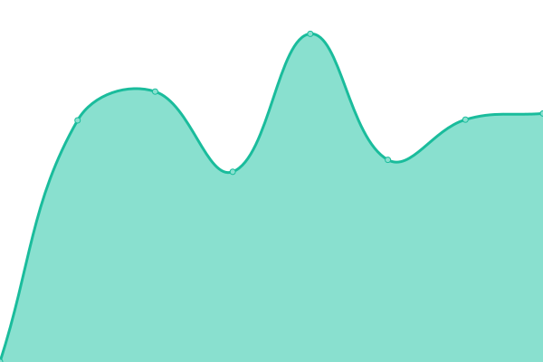

# [📈 Live Status](https://abteilung.github.io/upptime): <!--live status--> **🟩 All systems operational**

This repository contains the open-source uptime monitor and status page for [Abteilung für Gestaltung GmbH](http://www.abteilung.ch), powered by [Upptime](https://github.com/upptime/upptime).

With [Upptime](https://upptime.js.org), you can get your own unlimited and free uptime monitor and status page, powered entirely by a GitHub repository. We use [Issues](https://github.com/abteilung/upptime/issues) as incident reports, [Actions](https://github.com/abteilung/upptime/actions) as uptime monitors, and [Pages](https://abteilung.github.io/upptime) for the status page.

<!--start: status pages-->
<!-- This summary is generated by Upptime (https://github.com/upptime/upptime) -->
<!-- Do not edit this manually, your changes will be overwritten -->
<!-- prettier-ignore -->
| URL | Status | History | Response Time | Uptime |
| --- | ------ | ------- | ------------- | ------ |
|  [Abteilung.ch](https://abteilung.ch) | 🟩 Up | [abteilung-ch.yml](https://github.com/abteilung/upptime/commits/HEAD/history/abteilung-ch.yml) | 

 1101ms
     
 | 

<a href="https://abteilung.github.io/upptime/history/abteilung-ch">100.00%</a>
    

|  [Landolf & Huber Juweliere](https://landolfhuber.ch) | 🟩 Up | [landolf-and-huber-juweliere.yml](https://github.com/abteilung/upptime/commits/HEAD/history/landolf-and-huber-juweliere.yml) | 

 1129ms
     
 | 

<a href="https://abteilung.github.io/upptime/history/landolf-and-huber-juweliere">100.00%</a>
    

|  [Rychiger AG](https://rychiger.ch) | 🟩 Up | [rychiger-ag.yml](https://github.com/abteilung/upptime/commits/HEAD/history/rychiger-ag.yml) | 

 1104ms
     
 | 

<a href="https://abteilung.github.io/upptime/history/rychiger-ag">100.00%</a>
    

|  [Ades.ch](https://ades.ch) | 🟩 Up | [ades-ch.yml](https://github.com/abteilung/upptime/commits/HEAD/history/ades-ch.yml) | 

 984ms
     
 | 

<a href="https://abteilung.github.io/upptime/history/ades-ch">100.00%</a>
    

|  [SGUV](https://sguv.ch) | 🟩 Up | [sguv.yml](https://github.com/abteilung/upptime/commits/HEAD/history/sguv.yml) | 

 1705ms
     
 | 

<a href="https://abteilung.github.io/upptime/history/sguv">100.00%</a>
    

|  [DSIM](https://dsim.ch) | 🟩 Up | [dsim.yml](https://github.com/abteilung/upptime/commits/HEAD/history/dsim.yml) | 

 848ms
     
 | 

<a href="https://abteilung.github.io/upptime/history/dsim">100.00%</a>
    

|  [Ally.Vision](https://ally.vision) | 🟩 Up | [ally-vision.yml](https://github.com/abteilung/upptime/commits/HEAD/history/ally-vision.yml) | 

 1927ms
     
 | 

<a href="https://abteilung.github.io/upptime/history/ally-vision">100.00%</a>
    

|  [My.Ally.Vision](https://my.ally.vision) | 🟩 Up | [my-ally-vision.yml](https://github.com/abteilung/upptime/commits/HEAD/history/my-ally-vision.yml) | 

 3056ms
     
 | 

<a href="https://abteilung.github.io/upptime/history/my-ally-vision">100.00%</a>
    

|  [EAO](https://eao.com) | 🟩 Up | [eao.yml](https://github.com/abteilung/upptime/commits/HEAD/history/eao.yml) | 

 1659ms
     
 | 

<a href="https://abteilung.github.io/upptime/history/eao">100.00%</a>
    

|  [Selfix AG](https://selfix.ch) | 🟩 Up | [selfix-ag.yml](https://github.com/abteilung/upptime/commits/HEAD/history/selfix-ag.yml) | 

 3051ms
     
 | 

<a href="https://abteilung.github.io/upptime/history/selfix-ag">100.00%</a>
    

<!--end: status pages-->

[**Visit our status website →**](https://abteilung.github.io/upptime)

## 📄 License

- Powered by: [Upptime](https://github.com/upptime/upptime)
- Code: [MIT](./LICENSE) © [Abteilung für Gestaltung GmbH](http://www.abteilung.ch)
- Data in the `./history` directory: [Open Database License](https://opendatacommons.org/licenses/odbl/1-0/)
